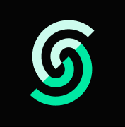

  

  

 
  
<h1 align="center">
 Recent projects    
</h1>
 

<table>
  <thead style="text-align: center;>
    <tr style="text-align: center;">
      <th style="text-align: center;">Project Name</th>
      <th style="text-align: center;">App Type</th>
      <th style="text-align: center;">Tech Stack</th>
      <th style="text-align: center;">Vid Reference</th>
      <th style="text-align: center;">Vid Duration</th>
      <th style="text-align: center;">Completed</th>
    </tr>
  </thead>
  <tbody>
  <tr>
      <td><a href="https://github.com/rr3s1/portfoli0_jsm">Portfolio Aceternity</a></td>
      <td style="text-align: center;">
        Landing Page
      </td>
      <td>
      
       
               
              
        
       </td>
      <td><a href="https://www.youtube.com/watch?v=FTH6Dn3AyIQ&t=6761s&ab_channel=JavaScriptMastery">Adrian Hajdin</a></td>
      <td style="text-align: center;">
        2 hours
      </td>
      <td style="text-align: center;">
        Sep 2024
      </td>
    </tr>
  <tr>
      <td><a href="https://github.com/rr3s1/JSM-SaaS-Landing-Page">Xora Modern UI</a></td>
      <td style="text-align: center;">
        Landing Page
      </td>
      <td>
        
        
        
        
       </td>
      <td><a href="https://www.youtube.com/watch?v=ukiGFmZ32YA&t=3s&ab_channel=JavaScriptMastery">Adrian Hajdin</a></td>
      <td style="text-align: center;">
        2 hours
      </td>
      <td style="text-align: center;">
        Oct 2024
      </td>
    </tr>
     <tr>
      <td><a href="https://github.com/rr3s1/JSM_3D_ThreeJS_Portfolio">Portfolio 3D</a></td>
      <td style="text-align: center;">
        Landing Page
      </td>
      <td>
          
          
          
          
          
      
</td>
      <td><a href="https://www.youtube.com/watch?v=kt0FrkQgw8w&t=3910s&ab_channel=JavaScriptMastery">Adrian Hajdin</a></td>
      <td style="text-align: center;">
        3 hours
      </td>
      <td style="text-align: center;">
        Oct 2024
      </td>
    </tr>
    <tr>
      <td><a href="https://github.com/rr3s1/jsm_medical_schedule_app">Healthcare MedCare</a></td>
      <td style="text-align: center;">
        Fullstack Web
      </td>
      <td>
      
        
        
        
        
        
        </td>
      <td><a href="https://www.youtube.com/watch?v=lEflo_sc82g&t=2776s&ab_channel=JavaScriptMastery">Adrian Hajdin</a></td>
      <td style="text-align: center;">
        5 hours
      </td style="text-align: center;">
      <td style="text-align: center;">
        Nov 2024
      </td>
    </tr>
     <tr>
      <td><a href="https://github.com/rr3s1/awwWW">Zentry Awwwards</a></td>
      <td style="text-align: center;">
        Landing Page
      </td>
      <td>
      
       
        
        
        
      </td>
      <td><a href="https://www.youtube.com/watch?v=zA9r5zTllx4&t=211s&ab_channel=JavaScriptMastery">Adrian Hajdin</a></td>
      <td style="text-align: center;">
        2 hours
      </td>
      <td style="text-align: center;">
        Nov 2024
      </td>
    </tr>
    <tr>
      <td><a href="https://github.com/rr3s1/jsm_storeit">File Management</a></td>
      <td style="text-align: center;">
        Fullstack Web
      </td>
      <td>
      
       
      
        
          
          
      </td>
      <td><a href="https://www.youtube.com/watch?v=lie0cr3wESQ&t=2051s&ab_channel=JavaScriptMastery">Adrian Hajdin</a></td>
      <td style="text-align: center;">
        5 hours
      </td>
      <td style="text-align: center;">
        Dec 2024
      </td>
    </tr>
    <tr>
      <td><a href="https://github.com/rr3s1/3D-iPhone15-GSAP"> 3D iPhone clone</a></td>
      <td style="text-align: center;">
        Landing Page
      </td>
      <td>
      
       
        
        
        
      </td>
      <td><a href="https://www.youtube.com/watch?v=kRQbRAJ4-Fs&t=8121s&ab_channel=JavaScriptMastery">Adrian Hajdin</a></td>
      <td style="text-align: center;">
        3 hours
      </td>
      <td style="text-align: center;">
        Dec 2024
      </td>
    </tr>
    </tr>
     <tr>
      <td><a href="https://github.com/rr3s1/BookWise-Uni-Library">University Library</a></td>
      <td style="text-align: center;">
        Fullstack Web
      </td>
      <td> 
      
      
      
      
      
      
      
      
      </td>
      <td><a href="https://www.youtube.com/watch?v=EZajJGOMWas&t=501s&ab_channel=JavaScriptMastery">Adrian Hajdin</a></td>
      <td style="text-align: center;">
       6 hours
      </td>
      <td style="text-align: center;">
        18 %
      </td>
    </tr>
     <tr>
      <td><a href="https://github.com/rr3s1/Real-Estate-MobileApp">Real Estate</a></td>
      <td style="text-align: center;">
        Fullstack Mob
      </td>
      <td>
      
      
      
      
      
      
      </td>
      <td><a href="https://www.youtube.com/watch?v=CzJQEstIiEI&ab_channel=JavaScriptMastery">Adrian Hajdin</a></td>
      <td style="text-align: center;">
       4 hours
      </td>
      <td style="text-align: center;">
        16 %
      </td>
    </tr>
    <tr>
      <td><a href="https://github.com/rr3s1/uber_mobile">Uber Clone</a></td>
      <td style="text-align: center;">
        Fullstack Mob
      </td>
      <td>
      
      
      
      
            
      
      
      
      </td>
      <td><a href="https://www.youtube.com/watch?v=kmy_YNhl0mw&t=2072s&ab_channel=JavaScriptMastery">Adrian Hajdin</a></td>
      <td style="text-align: center;">
       5 hours
      </td>
      <td style="text-align: center;">
        18 %
      </td>
    </tr>
    <tr>
      <td><a href="https://github.com/rr3s1/Food-Ordering">Food Ordering</a></td>
      <td style="text-align: center;">
        Fullstack Web
      </td>
      <td>
       

      

      </td>
      <td><a href="https://www.youtube.com/watch?v=ardeKHEN1j4&t=44672s&ab_channel=ChrisBlakely">Chris Blakely</a></td>
      <td style="text-align: center;">
       16 hours
      </td>
      <td style="text-align: center;">
        13 %
      </td>
    </tr>
     <tr>
      <td><a href="https://github.com/rr3s1/Ecommerce">Borcella E-commerce</a></td>
      <td style="text-align: center;">
        Fullstack Web
      </td>
      <td>
            
        
        
              
              

      </td>
      <td><a href="https://www.youtube.com/watch?v=SR4dFgdKUyI&ab_channel=CodeWithPhuc">Phuc Mai</a></td>
      <td style="text-align: center;">
       10 hours
      </td>
      <td style="text-align: center;">
      11 %
      </td>
    </tr>
    <tr>
      <td><a href="https://github.com/rr3s1/LearnHeaven-App">Tutorials Platform</a></td>
      <td style="text-align: center;">
        Fullstack Web
      </td>
      <td>
         

            

  

      </td>
      <td><a href="https://www.youtube.com/watch?v=61vSIrg70xM&t=238s&ab_channel=EdRoh">Ed Roh</a></td>
      <td style="text-align: center;">
       10 hours
      </td>
      <td style="text-align: center;">
        10 %
      </td>
    </tr>
     <tr>
      <td><a href="https://github.com/rr3s1/Tickets-Market">Event Tickets Market</a></td>
      <td style="text-align: center;">
        Fullstack Web
      </td>
      <td>
                  
        

      <td><a href="https://www.youtube.com/watch?v=KdYci4gA2os&ab_channel=SonnySangha">Sonny Sangha</a></td>
      <td style="text-align: center;">
        6 hours
      </td>
      <td style="text-align: center">
        20 %
      </td>
    </tr>
    <tr>
      <td><a href="https://github.com/rr3s1/BookWise-Uni-Library">Movies R19</a></td>
      <td style="text-align: center;">
        Fullstack Web
      </td>
      <td>
      
      
      
      
      </td>
      <td><a href="https://www.youtube.com/watch?v=dCLhUialKPQ&t=365s">Adrian Hajdin</a></td>
      <td style="text-align: center;">
       2 hours
      </td>
      <td style="text-align: center;">
        2 %
      </td>
    </tr>
  </tbody>
</table>
 
<h4 align="center">OneNote documentation</h4> 

 

    
    
  

 

<table>
  <!-- Row 1 -->
  <tr>
    <td></td>
    <td style="width: 50px;"></td>
    <td></td>
    <td style="width: 50px;"></td>
    <td></td>
    <td style="width: 50px;"></td>
    <td></td>
  </tr>

  <!-- Row 2 -->
  <tr>
    <td></td>
    <td style="width: 50px;"></td>
    <td></td>
    <td style="width: 50px;"></td>
    <td></td>
    <td style="width: 50px;"></td>
    <td></td>
  </tr>

  <!-- Row 3 -->
  <tr>
    <td></td>
    <td style="width: 50px;"></td>
    <td></td>
    <td style="width: 50px;"></td>
    <td></td>
    <td style="width: 50px;"></td>
    <td></td>
  </tr>
</table>

 

  

 

<!-- Custom Footer -->

